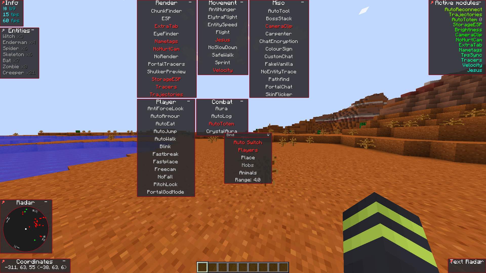
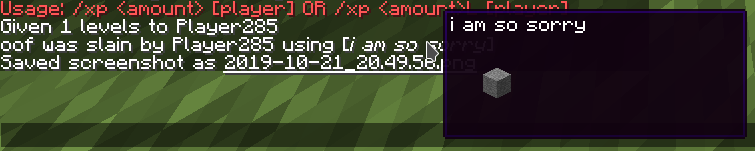
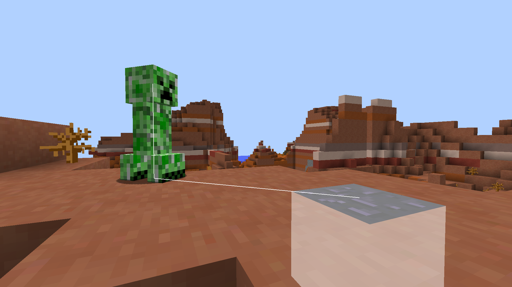

# KAMI
[](https://travis-ci.com/zeroeightysix/KAMI)
[](https://github.com/zeroeightysix/kami/issues)
[](http://discord.gg/9hvwgeg)

## A minecraft utility mod for anarchy servers.

Development has slowed down considerably.

See [forgehax](https://github.com/fr1kin/forgehax) for a more polished equivalent. Some features in KAMI may be based on those of forgehax, as I sometimes used it as reference.

Please note Baritone is no longer included. Download the standalone jar [from here](https://github.com/cabaletta/baritone/releases).

## Preview

<details>
 <summary>Click to view images</summary>

 

 
 
 

</details>

## Installing

KAMI is a forge mod. Start by downloading the latest version of [1.12.2 forge](https://files.minecraftforge.net/).
1. Install forge
2. Navigate to your `.minecraft` directory.
   * **Linux**: `~/.minecraft`
   * **Windows**: `%appdata%/.minecraft`
3. Navigate to the `mods` directory. If it doesn't exist, create it.
4. Obtain the KAMI `.jar` file.
   * By **downloading** it: see [releases](../../releases)
   * By **building** it: see [building](#building).
5. Place the `.jar` file in your mods directory.

## How do I

##### Open the GUI
Press Y.

##### Use commands
The default prefix is `.`. Commands are used through chat, use `.commands` for a list of commands.

##### Bind modules
Run `.bind <module> <key>`.

You can also use `.bind modifiers on` to allow modules to be bound to keybinds with modifiers, e.g `ctrl + shift + w` or `ctrl + c`.

##### Change command prefix
By using the command `prefix <prefix>` or after having ran KAMI (make sure it's closed), editing your configuration file (find it using `config path` in-game) and changing the value of `commandPrefix` to change the prefix.

## Troubleshooting
Please reference the main [troubleshooting page](docs/TROUBLESHOOTING.md)

If you experience an issue and it's not listed there, please [open a new issue](../../issues/new) and a contributor will help you further.

## Contributing

You are free to clone, modify KAMI and make pull requests as you wish. To set up your development environment, make use of the following commands:

```
git clone https://github.com/zeroeightysix/KAMI/
cd KAMI
```

On GNU/Linux, run `chmod +x gradlew` and for the following commands use `./gradlew` instead of `gradlew.bat`

Of-course you can also use a Gradle installation if you for some reason want another version of gradle

```
gradlew.bat setupDecompWorkspace
```
Import KAMI into your IDE of choice. 

If you use IntelliJ, import from the `build.gradle` file and run `gradlew.bat genIntellijRuns`

If you use Eclipse run `gradlew.bat eclipse`

If you do not wish to run from an IDE, use `gradlew.bat runClient` to run KAMI.

### Building
#### Linux
You can build by running these commands (without the <>) in a terminal.
```
git clone https://github.com/zeroeightysix/KAMI/
cd KAMI

chmod +x gradlew
./gradlew <args>
```
Possible arguments:
```
build
mkdir
rmOld
copy
```
If you use more than one then it must be in that order. 

Build is required, `mkdir` makes the `mods/1.12.2` directory, `rmOld` removes old versions of KAMI\* in that directory, and `copy` copies the build release to the `mods/1.12.2` directory. 

\*`rmOld` removes any jars ending in `-release.jar`, which is the format KAMI uses. If you use any other mod that uses that naming scheme please remove old versions manually.

If you prefer copying it manually, find a file in `build/libs` called `KAMI-<minecraftVersion>-<kamiVersion>-**release**.jar` which you can copy to the `mods/1.12.2` folder of a minecraft instance that has forge installed.

Note: This assumes your minecraft folder is in the default location under your home folder.

#### Windows
You can build by running these commands in a terminal with the current directory being KAMI. (EG. `cd C:\Users\Username\Downloads\KAMI`)
```
gradlew.bat build
```

To copy on windows run `autocopy.bat`

If you prefer copying it manually, find a file in `build/libs` called `KAMI-<minecraftVersion>-<kamiVersion>-**release**.jar` which you can copy to the `mods\1.12.2` folder of a minecraft instance that has forge installed.

Note: This assumes your minecraft folder is in the default location under your %appdata% folder.

## Thank you
[ZeroMemes](https://github.com/ZeroMemes) for [Alpine](https://github.com/ZeroMemes/Alpine)

[ronmamo](https://github.com/ronmamo/) for [Reflections](https://github.com/ronmamo/reflections)

The [minecraft forge team](https://github.com/MinecraftForge) for [forge](https://files.minecraftforge.net/)
