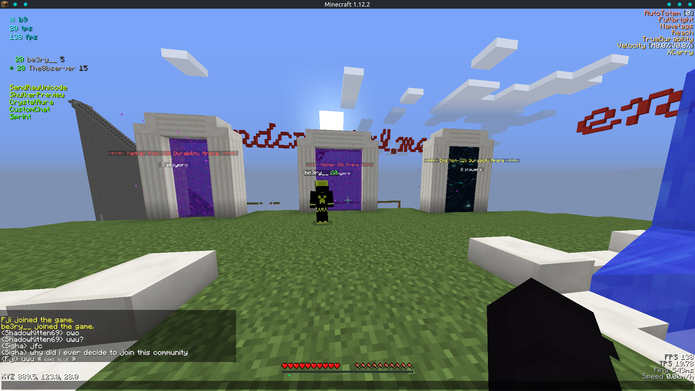

# KAMI Blue 

### A minecraft utility mod for anarchy servers.

|              | S-B99 (features-master)| 086 (upstream) |
|:------------:|:-------------:|:--------------:|
| Build Status |  |  |
| Media        |  |  |
| Version      |  |  |
<!--| Issues       |  |  |
-->
<!--| Build Status |  |  |  |-->
<!--| Issues       |  |  |  |-->
<!--| Media        |  |  |  |-->
<!--| Version      |  |  |  |-->

Please consider donating to help continue this project and get a unique cape in game in the future. Currently I've received about $50 from the [nearly 400](.github/IMAGES/traffic.png) *unique* visitors to this repo.

 

 

	
Click to view disclaimers

***

This will be frequently updated as long as I'm not on vacation or anything

This is by no means a finished project, nor is it a "cheat" or "hack" for anything, it is a *utility* mod.

Please note Baritone is no longer included. Download the standalone jar [from here](https://github.com/cabaletta/baritone/releases).

See [forgehax](https://github.com/fr1kin/forgehax) for an equivalent. Some features in KAMI may be based on those of forgehax, and KAMI / KAMI Blue have some features it doesn't. KAMI Blue won't be based off of other mods unless said otherwise.

***

## How to download

Press the releases button or [click here](https://github.com/S-B99/KAMI/releases)

## Status

	
Click to view current development status

***

[Everything here is planned for sure,](https://github.com/zeroeightysix/KAMI/pull/114) [along with here](https://github.com/S-B99/KAMI/issues/12) and the rest of the issues with a milestone attached.

This is currently in slowed development. Maintainance and further development is planned in the next couple months.

***

## Preview

	
Click to view images

***

Click on images to expand

***

Note: GUI Color is a work in progress and unreleased

GUI When Closed

Ignore the GUI on the right, that's future

Shulker preview being used in chat

CrystalAura targeting

***

## Installing

To install drag the `VERSION-release.jar` to your `mods/1.12.2` folder

	
Click to see more detailed installing instructions

KAMI Blue is a forge mod. Start by downloading the latest version of [1.12.2 forge](https://files.minecraftforge.net/maven/net/minecraftforge/forge/index_1.12.2.html).
1. Install forge
2. Go to your `.minecraft` directory.
   * **Linux**: `~/.minecraft`
   * **Windows**: `%appdata%/.minecraft`
3. Navigate to the `mods` directory. If it doesn't exist, create it.
4. Get the KAMI Blue `.jar` file.
   * By **downloading** it: see [releases](../../releases)
   * By **building** it: see [building](#building).
5. Drag the `-release.jar` file into your mods directory.

## How do I

	
Click to see the frequently asked questions or basic stuff

***

##### Open the GUI
Press Y.

##### Use commands
The default prefix is `.`. Commands are used through chat, use `.commands` for a list of commands.

##### Bind modules
Run `.bind <module> <key>`.

You can also use `.bind modifiers on` to allow modules to be bound to keybinds with modifiers, e.g `ctrl + shift + w` or `ctrl + c`.

##### Change command prefix
By using the command `prefix <prefix>` or after having ran KAMI Blue (make sure it's closed), editing your configuration file (find it using `config path` in-game) and changing the value of `commandPrefix` to change the prefix.

***

## Troubleshooting

	
Please read this before opening an issue

***

Please reference the main [troubleshooting page](docs/TROUBLESHOOTING.md)

If you have an issue or problem and it's not listed there, please [open a new issue](../../issues/new/choose) and a contributor will help you further.

***

## How this actually improves over KAMI Red

	
Click to see new features and improvements

### Currently:

 - NoFall Bucket Mode picks up the water bucket after
 - Better mcmod.info with more information
 - Constant testing
 - Hey look an active developer
 - GUI is better
 - If someone does write code and add it to KAMI Red this generally gets it way faster

### Upcoming:

 - Modules under experimental (discord RPC, etc)
 - Stuff in [issues to be added](https://github.com/S-B99/KAMI/issues)
 - GUI Color Changer
 - CAPES! (donate $10 to unlock)
 - Fast place has options for speed coming soon
 - Modes for fast use and deleting fast place also soon
 - Auto32k will automatically enable and disable aura as an option

## Thank you

[zeroeightysix](https://github.com/zeroeightysix) for the original [KAMI](https://github.com/zeroeightysix/KAMI)

[ZeroMemes](https://github.com/ZeroMemes) for [Alpine](https://github.com/ZeroMemes/Alpine)

[ronmamo](https://github.com/ronmamo/) for [Reflections](https://github.com/ronmamo/reflections)

The [Minecraft Forge team](https://github.com/MinecraftForge) for [forge](https://files.minecraftforge.net/)
