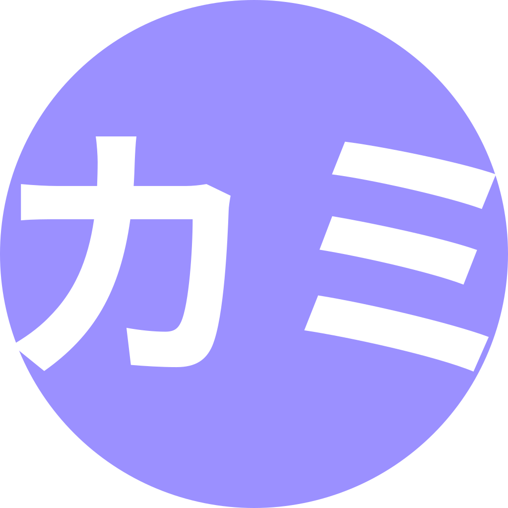

# KAMI 


### A minecraft utility mod for anarchy servers.

|              | S-B99 (features-master)  | S-B99 (master) | 086 (upstream) |
|:------------:|:-------------:|:--------------:|:--------------:|
| Build Status | [](https://travis-ci.com/S-B99/KAMI/tree/features-master) | [](https://travis-ci.com/S-B99/KAMI/tree/master) | [](https://travis-ci.com/zeroeightysix/KAMI) |
| Issues       | [](https://github.com/S-B99/kami/issues) | [](https://github.com/S-B99/kami/issues) | [](https://github.com/zeroeightysix/kami/issues) |
| Media        | [](https://discord.gg/KfpqwZB) | [](https://discord.gg/KfpqwZB) | [](http://discord.gg/9hvwgeg) |
| Version      | [](https://github.com/S-B99/KAMI/releases) | [](https://github.com/S-B99/KAMI/releases) | [](https://github.com/zeroeightysix/KAMI/releases) |

This will be frequently updated as long as I'm not on vacation or anything

<details>
	<summary>Click to view disclaimers</summary>

This is by no means a finished project, nor is it a "cheat" or "hack" for anything, it is a *utility* mod.

Please note Baritone is no longer included. Download the standalone jar [from here](https://github.com/cabaletta/baritone/releases).

See [forgehax](https://github.com/fr1kin/forgehax) for an equivalent. Some features in KAMI may be based on those of forgehax, and KAMI / Blue KAMI have some features it doesn't. Blue KAMI won't be based off of other mods unless said otherwise.

</details>

## How to download

Press the releases button along the yellow bar above ^

Scroll alll the way up

## Status

<details>
	<summary>Click to view current development status</summary>

[Everything here is planned for sure,](https://github.com/zeroeightysix/KAMI/pull/114) [along with here](https://github.com/S-B99/KAMI/issues/12)

This is currently in slowed development. Maintainance and further development is planned in the next couple months.

</details>

## Preview

<details>
	<summary>Click to view images</summary>


</details>

## Installing

Blue KAMI is a forge mod. Start by downloading the latest version of [1.12.2 forge](https://files.minecraftforge.net/).
1. Install forge
2. Go to your `.minecraft` directory.
   * **Linux**: `~/.minecraft`
   * **Windows**: `%appdata%/.minecraft`
3. Navigate to the `mods` directory. If it doesn't exist, create it.
4. Get the Blue KAMI `.jar` file.
   * By **downloading** it: see [releases](../../releases)
   * By **building** it: see [building](#building).
5. Drag the `-release.jar` file into your mods directory.

## How do I

<details>
	<summary>Click to see the frequently asked questions or basic stuff</summary>

##### Open the GUI
Press Y.

##### Use commands
The default prefix is `.`. Commands are used through chat, use `.commands` for a list of commands.

##### Bind modules
Run `.bind <module> <key>`.

You can also use `.bind modifiers on` to allow modules to be bound to keybinds with modifiers, e.g `ctrl + shift + w` or `ctrl + c`.

##### Change command prefix
By using the command `prefix <prefix>` or after having ran Blue KAMI (make sure it's closed), editing your configuration file (find it using `config path` in-game) and changing the value of `commandPrefix` to change the prefix.

##### Change Custom Chat ending
Edit line 19 in `kami/src/main/java/me/zeroeightysix/kami/module/modules/misc/CustomChat.java`
Change the `\u23D0` characters to something else you want, [use this website to do it](https://www.branah.com/unicode-converter).
Paste text in the first box and copy the output from the second.

This will be implemented with a command in the near future, see issue [#11](https://github.com/S-B99/KAMI/issues/11)

</details>

## Troubleshooting

<details>
	<summary>Please read this before opening an issue</summary>

Please reference the main [troubleshooting page](docs/TROUBLESHOOTING.md)

If you have an issue or problem and it's not listed there, please [open a new issue](../../issues/new/choose) and a contributor will help you further.

</details>

### Building
#### Linux
You can build by running these commands (without the <>) in a terminal.
```
git clone https://github.com/S-B99/KAMI/
cd KAMI

chmod +x gradlew
./gradlew <args>
```
Possible arguments:
```
build
mkdir
rmOld
copy
```
If you use more than one then it must be in that order. 

Build is required, `mkdir` makes the `mods/1.12.2` directory, `rmOld` removes old versions of KAMI and Blue KAMI\* in that directory, and `copy` copies the build release to the `mods/1.12.2` directory. 

\*`rmOld` removes any jars ending in `-release.jar`, which is the format KAMI used and that Blue KAMI uses. If you use any other mod that uses that naming scheme please remove old versions manually.

If you prefer copying it manually, find a file in `build/libs` called `KAMI-<kamiVersion>-**release**.jar` which you can copy to the `mods/1.12.2` folder of a minecraft instance that has forge installed.

Note: This assumes your minecraft folder is in the default location under your home folder.

Note: Any argument other then `build` assumes you downloaded Blue KAMI to a nested folder inside your home folder. For example `~/Downloads/KAMI` or `~/Documents/KAMI`. This will be fixed as per [issue #15](https://github.com/S-B99/KAMI/issues/15)

#### Windows
You can build by running these commands in a terminal with the current directory being KAMI. (EG. `cd C:\Users\Username\Downloads\KAMI`)
```
gradlew.bat build
```

To copy on windows run `autocopy.bat`

If you prefer copying it manually, find a file in `build/libs` called `KAMI-<kamiVersion>-**release**.jar` which you can copy to the `mods\1.12.2` folder of a minecraft instance that has forge installed.

Note: This assumes your minecraft folder is in the default location under your %appdata% folder.

## Contributing

You are free to clone, modify KAMI and Blue KAMI and make pull requests as you wish. To set up your development environment, make use of the following commands:

On GNU/Linux, run `chmod +x gradlew` and for the following commands use `./gradlew` instead of `gradlew.bat`

Of-course you can also use a Gradle installation if you for some reason want another version of gradle
```
git clone https://github.com/S-B99/KAMI/
cd KAMI
```
Import Blue KAMI into your IDE of choice. 
```
gradlew.bat setupDecompWorkspace
gradlew.bat genIntellijRuns #for intellij
gradlew.bat eclipse #for eclipse
```
If you use IntelliJ, import `build.gradle`

If you use Eclipse, import a new gradle project and select the KAMI folder. 

If you have gradle related issues with either of these force your gradle version to `4.8.1`

If you do not wish to run from an IDE, use `gradlew.bat runClient` to run Blue KAMI.

## Thank you

[zeroeightysix](https://github.com/zeroeightysix) for the original [KAMI](https://github.com/zeroeightysix/KAMI)

[ZeroMemes](https://github.com/ZeroMemes) for [Alpine](https://github.com/ZeroMemes/Alpine)

[ronmamo](https://github.com/ronmamo/) for [Reflections](https://github.com/ronmamo/reflections)

The [Minecraft Forge team](https://github.com/MinecraftForge) for [forge](https://files.minecraftforge.net/)
